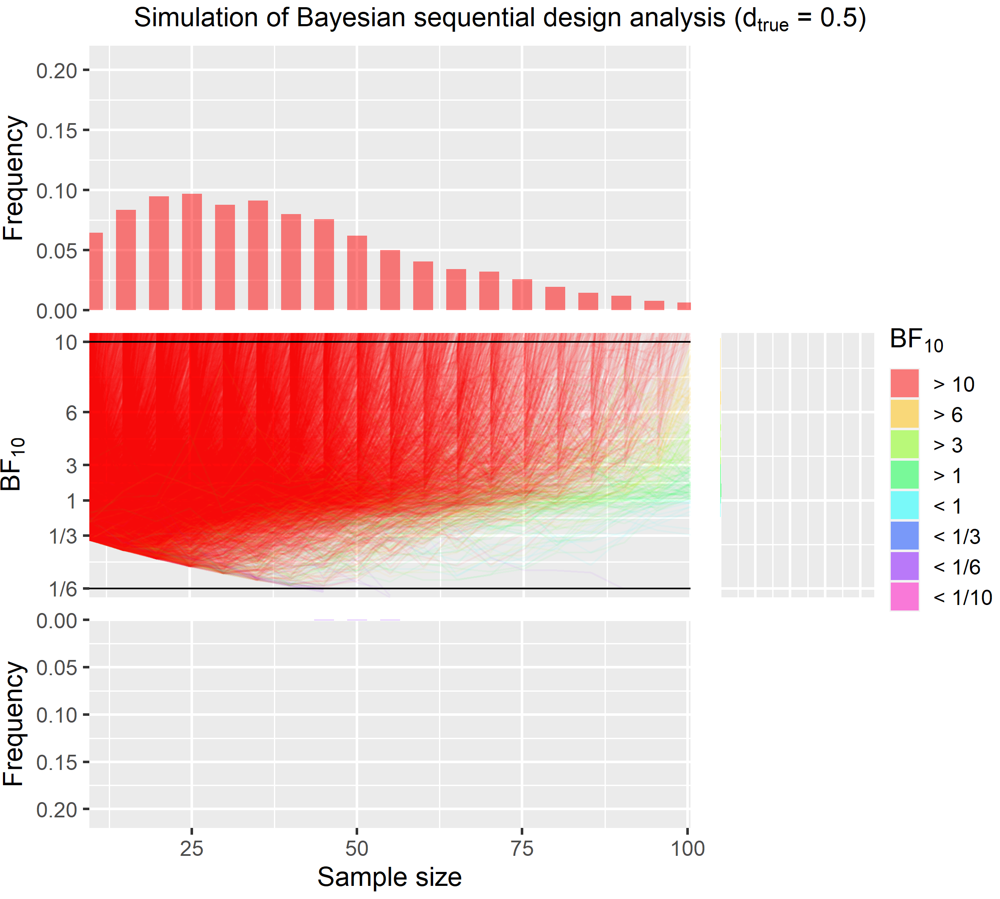

```{r setup, include=FALSE}
knitr::opts_chunk$set(echo = FALSE)

library(plyr)
library(BayesFactor)
library(knitr)
library(assortedRFunctions)

options(scipen = 10)
```

This post is based on a short talk that I gave at the MRC CBU on the 29 July 2020 for a session on statistical power, which can be found [here](https://github.com/JAQuent/bayesianSequentialDesign). This repository also includes all the data and script that were used to run the simulations and to create the figures. Most of this talk as well as of this post is based on Schoenbrodt & Wagenmakers (2018) fantastic paper that I encourage you to read as well as the other good articles in that special on Bayesian statistics. 

Like a traditional power analysis using frequentist statistics, we can calculate for which fixed sample size we get a Bayes factor (BF) surpassing a certain criterion in let's say 80 % of the cases if repeated the data collection multiple times assuming a specific fixed effect size. 

This is illustrated in the Figure below:

 

```{r, eval = TRUE}
load("simulationResults.RData")

crit1 <- 10
crit2 <- 1/6

# Calculatge percentage
df1_2            <- subset(df1, df1$side == 2)
df1_2$overCrit1  <- df1_2$bf > crit1
df1_2$belowCrit2 <- df1_2$bf < crit2
df1_2[df1_2$d == 0.0, 'overCrit1']  <- NA
df1_2[df1_2$d == 0.5, 'belowCrit2'] <- NA
df1_2_agg         <- ddply(df1_2, c('n'), summarise, per_crit1 = mean(overCrit1, na.rm = TRUE), per_crit2 = mean(belowCrit2, na.rm = TRUE))

# Misleading evidence
df1_2_miss            <- df1_2
df1_2_miss$overCrit1  <- df1_2_miss$bf > crit1
df1_2_miss$belowCrit2 <- df1_2_miss$bf < crit2
df1_2_miss_agg        <- ddply(df1_2_miss, c('n', 'd'), summarise, per_crit1 = mean(overCrit1, na.rm = TRUE), per_crit2 = mean(belowCrit2, na.rm = TRUE))


table1 <- data.frame(v1 = c(0.5, 0.0),
                     v2 = c(min(df1_2_agg[df1_2_agg$per_crit1 >= 0.8, 'n']), min(df1_2_agg[df1_2_agg$per_crit2 >= 0.8, 'n'])),
                     v3 = c(df1_2_miss_agg[df1_2_miss_agg$n == min(df1_2_agg[df1_2_agg$per_crit1 >= 0.8, 'n']) & df1_2_miss_agg$d == 0.5 , 'per_crit2'], 
                            df1_2_miss_agg[df1_2_miss_agg$n == min(df1_2_agg[df1_2_agg$per_crit2 >= 0.8, 'n']) & df1_2_miss_agg$d == 0.0 , 'per_crit1']))

names(table1) <- c('Effect size', 'Necessary sample size', 'Misleading evidence in %')
                     
table1$`£ for online experiment` <- round(table1$`Necessary sample size`*8.40)
table1$`£ for fMRI experiment`   <- round(table1$`Necessary sample size`*550)
```

This figure shows the results of a traditional fixed sample size design analysis. It is based on a Bayesian one-sample _t_-test and shows the percentage of surpassing the criteria as a function of the sample size. The blue line shows the percentage for $BF_{10}$ over 10 for a true medium effect size of 0.5, while the red line shows a $BF_{10}$ below 1/6 for a true null effect size of 0.0. I choose this asymmetric cut-off because it is much more difficult to get strong evidence for the point $H_0$ than it is for the $H_1$. Similarly, to each high percentage values like 95 %, we would need a sample size that is much larger than this in fact over 1000. Side-note, this simulation like on the one in this post is based on 10,000 iterations. If we plan for true effect size of 0.5, the necessary sample size is `r table1[1,2]`, while it is `r table1[2,2]` if the true effect size is 0.0. Collecting a sample size that is that large for one experiment is quite impossible for a basic science experiment in my field (cognitive neuroscience).

Likely, there is a way to reliably produce strong evidence with sample that are much smaller. For that we need _Sequential Bayesian Designs_. The properties of the BF allows us to peak at the data multiple times to see what the current evidence from our data is. In a sequential design we essentially keep on collecting data until reached the pre-specified evidence criteria for instance a $BF_{10} > 10$ or $BF_{10} < 1/6$. Below you see an example piece of code that can run this kind of simulation in simple for loop.

```{r, eval = FALSE, echo = TRUE}
# Setting seed
set.seed(2)

# Parameters
minN      <- 10
batchSize <- 5
crit1     <- 10
crit2     <- 1/6
maxN      <- 300
nIter     <- 100
d         <- 0

for(i in 1:nIter){
  # First iteration
  data <- rnorm(minN, d, 1)
  n    <- minN
  bf   <- reportBF(ttestBF(data))
  
  # Loop
  while(bf[length(bf)] < crit1 & bf[length(bf)] > crit2){
    data <- c(data, rnorm(minN, d, 1))
    bf[length(bf) + 1] <- reportBF(ttestBF(data))
    n[length(n) + 1]   <- n[length(n)] + batchSize
  }
  
  if(i == 1){
    df <- data.frame(id = rep(i, length(bf)), n = n, bf = bf)
  } else {
    df <- rbind(df, data.frame(id =  rep(i, length(bf)), n = n, bf = bf))
  }
}
```

In this example we start with a sample size of 10 and then keep adding 5 more data points until we either reach `crit1` or `crit2`. The true effect size here is 0.0. This simulation of 100 iterations is illustrated in this animation highlighting the sequential nature of the data collection. Note that the x-axis is the sample size. Each individual line represents one run in this simulation. 


A full simulation of 10,000 iteration is shown in the figure below. The true effect size here is 0.0.

```{r, eval = TRUE, echo = FALSE}
nIter <- 10000

############### d = 0.0
tempDF <- subset(df2, side == 2 & d == 0.0)

tempDF$trans_bf <- NA
tempDF$trans_bf[tempDF$bf < 1] <- -1/tempDF$bf[tempDF$bf < 1] + 1
tempDF$trans_bf[tempDF$bf > 1] <- tempDF$bf[tempDF$bf > 1] - 1

tempDF_agg <- ddply(tempDF, c('id'), summarise, n = n[length(n)], bf = bf[length(bf)])
tempDF_agg$support <- 'undecided'
tempDF_agg$support[tempDF_agg$bf > crit1] <- 'H1'
tempDF_agg$support[tempDF_agg$bf < crit2] <- 'H0'

# Creates band
tempDF_agg$band                                             <- '> 10'
tempDF_agg$band[tempDF_agg$bf < 10 & tempDF_agg$bf > 6]     <- '> 6'
tempDF_agg$band[tempDF_agg$bf < 6 & tempDF_agg$bf > 3]      <- '> 3'
tempDF_agg$band[tempDF_agg$bf < 3 & tempDF_agg$bf > 1]      <- '> 1'
tempDF_agg$band[tempDF_agg$bf < 1 & tempDF_agg$bf > 1/3]    <- '< 1'
tempDF_agg$band[tempDF_agg$bf < 1/3 & tempDF_agg$bf > 1/6]  <- '< 1/3'
tempDF_agg$band[tempDF_agg$bf < 1/6 & tempDF_agg$bf > 1/10] <- '< 1/6'
tempDF_agg$band[tempDF_agg$bf < 1/10]                       <- '< 1/10'

# Create factor band
tempDF_agg$band <- factor(tempDF_agg$band, levels = c('> 10', '> 6', '> 3', '> 1', '< 1', '< 1/3', '< 1/6', '< 1/10'))

# Get back to main DF
tempDF$band <- rep(tempDF_agg$band, table(tempDF$id))

# Create lower histogram
tempDF_agg_supp_H0 <- ddply(subset(tempDF_agg, support == 'H0'),
                            c('n', 'band'),
                            summarise,
                            freq = length(bf)/nIter)
# Create upper histogram
tempDF_agg_supp_H1 <- ddply(subset(tempDF_agg, support == 'H1'),
                            c('n', 'band'),
                            summarise,
                            freq = length(bf)/nIter)

# Get sample sizes
sampleSize_df1           <- rbind(tempDF_agg_supp_H0, tempDF_agg_supp_H1)
sampleSize_df1$count     <- sampleSize_df1$freq * nIter
tempDF_agg_supp_H1$count <- tempDF_agg_supp_H1$freq * nIter

#Calculate results
avgN1    <- round(mean(rep(sampleSize_df1$n, sampleSize_df1$count)))
misLead1 <- sum(tempDF_agg_supp_H1$freq)*100
maxN1    <- max(tempDF_agg$n)
```


Here is a quick explanation of that this figure shows. For the code to generated this figure see [here](https://github.com/JAQuent/bayesianSequentialDesign). Like in the animation, each individual line in the middle part of the figure represents one iteration of this simulation. The lines are colour coded based on the final BF (red = $BF_{10} > 10$, purple =  $BF_{10} < 1/6$). At the top and the bottom, you see histograms showing how many BF were above and below the criteria for each sample size. Two things are apparent at the first glance. First, there is very little misleading evidence. Misleading evidence for this simulation mean $BF_{10} > 10$ as the true effect is 0.0. The red lines in the middle and the barely perceptible red bars in the top histogram show this. Second, most simulations end well before the `r table1[2, 2]` that are need to get a $BF_{10} < 1/6$ 80 % of the times in the traditional design but we also see that in some case data collection goes well beyond 500 data points and in fact this figure is capped at 1000 for illustration in fact the highest sample size was `r maxN1` and `r sum(tempDF_agg$n > 1000)` were above 1000. On average, however we can stop data collection with sample size of only `r avgN1`, which is much lower than the traditional design. 

For further illustration, I also present a simulation were we have true medium effect size of 0.5. 


```{r, echo = FALSE, eval = TRUE}
############### d = 0.5
tempDF <- subset(df2, side == 2 & d == 0.5)

tempDF$trans_bf <- NA
tempDF$trans_bf[tempDF$bf < 1] <- -1/tempDF$bf[tempDF$bf < 1] + 1
tempDF$trans_bf[tempDF$bf > 1] <- tempDF$bf[tempDF$bf > 1] - 1

tempDF_agg <- ddply(tempDF, c('id'), summarise, n = n[length(n)], bf = bf[length(bf)])
tempDF_agg$support <- 'undecided'
tempDF_agg$support[tempDF_agg$bf > crit1] <- 'H1'
tempDF_agg$support[tempDF_agg$bf < crit2] <- 'H0'


# Creates band
tempDF_agg$band                                             <- '> 10'
tempDF_agg$band[tempDF_agg$bf < 10 & tempDF_agg$bf > 6]     <- '> 6'
tempDF_agg$band[tempDF_agg$bf < 6 & tempDF_agg$bf > 3]      <- '> 3'
tempDF_agg$band[tempDF_agg$bf < 3 & tempDF_agg$bf > 1]      <- '> 1'
tempDF_agg$band[tempDF_agg$bf < 1 & tempDF_agg$bf > 1/3]    <- '< 1'
tempDF_agg$band[tempDF_agg$bf < 1/3 & tempDF_agg$bf > 1/6]  <- '< 1/3'
tempDF_agg$band[tempDF_agg$bf < 1/6 & tempDF_agg$bf > 1/10] <- '< 1/6'
tempDF_agg$band[tempDF_agg$bf < 1/10]                       <- '< 1/10'

# Create factor band
tempDF_agg$band <- factor(tempDF_agg$band, levels = c('> 10', '> 6', '> 3', '> 1', '< 1', '< 1/3', '< 1/6', '< 1/10'))


# Get back to main DF
tempDF$band <- rep(tempDF_agg$band, table(tempDF$id))


# Create upper histogram
tempDF_agg_supp_H1 <- ddply(subset(tempDF_agg, support == 'H1'),
                           c('n', 'band'),
                           summarise,
                           freq = length(bf)/nIter)

# Create lower histogram
tempDF_agg_supp_H0 <- ddply(subset(tempDF_agg, support == 'H0'),
                           c('n', 'band'),
                           summarise,
                           freq = length(bf)/nIter)


sampleSize_df2           <- rbind(tempDF_agg_supp_H0, tempDF_agg_supp_H1)
sampleSize_df2$count     <- sampleSize_df2$freq * nIter
tempDF_agg_supp_H0$count <- tempDF_agg_supp_H0$freq * nIter

# Calculate results
avgN2    <- round(mean(rep(sampleSize_df2$n, sampleSize_df2$count)))
misLead2 <- sum(tempDF_agg_supp_H0$freq)*100
maxN2    <- max(tempDF_agg$n)
```

This figure also clearly shows that most runs end much earlier than the `r table1[1, 2]` from the fixed sample size design. The highest sample size for this effect size is `r maxN2`. 


Now, to the most interesting part that is comparing the traditional fixed sample size design and the sequential design. In the table below, you see the costs for an 1-hour long online experiment on prolific (£ 8.4) and an 1-hour long fMRI experiment (full economic costs £ 550). 

```{r, echo = FALSE}
kable(table1)
```

Based on the results, we would need to spend a lot of money for each experiments. In the worst case scenario, where you plan for showing a null effect in fMRI experiment, you need to spend £ `r table1[2, 5]` it's less if you plan for a medium effect size but the problem is often we don't really have good estimate of the effect size. If we did, we might not even run the experiment. Johan Carlin recently gave talk where he among other things talked about the problem of bias effect size estimates and low power. This talks can be found [here](https://twitter.com/johancarlin/status/1273186119564144641).


```{r, eval = TRUE, echo = FALSE}
table2_2 <- data.frame(v1 = c(0.5, 0.0),
                     v2 = c(avgN2, avgN1),
                     v3 = c(maxN2, maxN1),
                     v3 = c(misLead2, misLead1))

names(table2_2) <- c('Effect size', 'Average sample size', 'Maximal sample size', 'Misleading evidence in %')

table2_2$`£ for online experiment` <- round(table2_2$`Average sample size`*8.40)
table2_2$`£ for fMRI experiment`   <- round(table2_2$`Average sample size`*550)
kable(table2_2)
```


In true sequential design we don't have this problem at all. Regardless of the true effect size we produce strong evidence and this on average much cheaper than with a fixed sample design. The average cost for an fMRI experiment for instance is only £ `r  table2_2[2, 6]`. This is only `r round(table2_2[2, 6]/table2_2[2, 5], 2)*100` % of the cost that we'd have to play for a traditional design. At the same times, it needs to be knowledge that the misleading evidence rate in much higher in sequential designs is much higher but still very low. For instance, for null effect in this simulation it is `r table2_2[4, 2]` %. If misleading evidence rates are of concerns than one thing that can be done is to increase the minimal sample size and the number of data points added in each batch. The effect of doing this is illustrated further below. 

A much bigger problem is that while the average sample size is much lower, sometimes we're unluckily and we haven't reached a stopping criteria even after 1000 data points. For a PhD running an fMRI experiment, this is just not feasible. Despite what [2 Unlimited](https://www.youtube.com/watch?v=awEnGXcmUXc) wants us to believe, practically there is often a limit that can be based on money, available participants or time constraints. One way to protect oneself against collecting extremely large samples is to set an upper limit and to accept that in rare and extreme cases we might stop despite note having reached a criterion and ending with inconclusive evidence. 

In the following, I will present a simulation where data collection is stopped after collecting 100 data points regardless of whether an evidence criterion is reached. 




```{r, eval = TRUE}
# Parmeter
maxN <- 100

###### D = 0.0
tempDF <- subset(df3, d == 0.0)

tempDF$trans_bf <- NA
tempDF$trans_bf[tempDF$bf < 1] <- -1/tempDF$bf[tempDF$bf < 1] + 1
tempDF$trans_bf[tempDF$bf > 1] <- tempDF$bf[tempDF$bf > 1] - 1

tempDF_agg <- ddply(tempDF, c('id'), summarise, n = n[length(n)], bf = bf[length(bf)])
tempDF_agg$support <- 'undecided'
tempDF_agg$support[tempDF_agg$bf > crit1] <- 'H1'
tempDF_agg$support[tempDF_agg$bf < crit2] <- 'H0'

# Creates band
tempDF_agg$band                                             <- '> 10'
tempDF_agg$band[tempDF_agg$bf < 10 & tempDF_agg$bf > 6]     <- '> 6'
tempDF_agg$band[tempDF_agg$bf < 6 & tempDF_agg$bf > 3]      <- '> 3'
tempDF_agg$band[tempDF_agg$bf < 3 & tempDF_agg$bf > 1]      <- '> 1'
tempDF_agg$band[tempDF_agg$bf < 1 & tempDF_agg$bf > 1/3]    <- '< 1'
tempDF_agg$band[tempDF_agg$bf < 1/3 & tempDF_agg$bf > 1/6]  <- '< 1/3'
tempDF_agg$band[tempDF_agg$bf < 1/6 & tempDF_agg$bf > 1/10] <- '< 1/6'
tempDF_agg$band[tempDF_agg$bf < 1/10]                       <- '< 1/10'

# Create factor band
tempDF_agg$band <- factor(tempDF_agg$band, levels = c('> 10', '> 6', '> 3', '> 1', '< 1', '< 1/3', '< 1/6', '< 1/10'))


# Get back to main DF
tempDF$band <- rep(tempDF_agg$band, table(tempDF$id))


# Create upper histogram
tempDF_agg_supp_H1 <- ddply(subset(tempDF_agg, support == 'H1'),
                           c('n', 'band'),
                           summarise,
                           freq = length(bf)/nIter)

# Create right histogram
tempDF_agg_undecided <- subset(tempDF_agg, tempDF_agg$n == maxN & tempDF_agg$bf < crit1 & tempDF_agg$bf > crit2)
tempDF_agg_undecided$trans_bf <- NA
tempDF_agg_undecided$trans_bf[tempDF_agg_undecided$bf < 1] <- -1/tempDF_agg_undecided$bf[tempDF_agg_undecided$bf < 1] + 1
tempDF_agg_undecided$trans_bf[tempDF_agg_undecided$bf > 1] <- tempDF_agg_undecided$bf[tempDF_agg_undecided$bf > 1] - 1


# Create lower histogram
tempDF_agg_supp_H0 <- ddply(subset(tempDF_agg, support == 'H0'),
                           c('n', 'band'),
                           summarise,
                           freq = length(bf)/nIter)


# Creates empty df for plotting if no values
if(nrow(tempDF_agg_supp_H0) == 0){
  tempDF_agg_supp_H0 <- data.frame(n = seq(1, 5, 1),
                                band = rep('< 1/10', 5),
                                freq = rep(0, 5))
}


sampleSize_df3           <- rbind(tempDF_agg_supp_H0, tempDF_agg_supp_H1)
sampleSize_df3$count     <- sampleSize_df3$freq * nIter
tempDF_agg_supp_H1$count <- tempDF_agg_supp_H1$freq * nIter

# Get summary
avgN1       <- round(mean(rep(sampleSize_df3$n, sampleSize_df3$count)))
misLead1    <- sum(tempDF_agg_supp_H1$freq)*100
strongEvi1  <- sum(tempDF_agg_supp_H0$freq)*100
undecided1  <- round(nrow(tempDF_agg_undecided)/nIter, 4)*100


######## d = 0.5
tempDF <- subset(df3, d == 0.5)
tempDF$trans_bf <- NA
tempDF$trans_bf[tempDF$bf < 1] <- -1/tempDF$bf[tempDF$bf < 1] + 1
tempDF$trans_bf[tempDF$bf > 1] <- tempDF$bf[tempDF$bf > 1] - 1

tempDF_agg <- ddply(tempDF, c('id'), summarise, n = n[length(n)], bf = bf[length(bf)])
tempDF_agg$support <- 'undecided'
tempDF_agg$support[tempDF_agg$bf > crit1] <- 'H1'
tempDF_agg$support[tempDF_agg$bf < crit2] <- 'H0'


# Creates band
tempDF_agg$band                                             <- '> 10'
tempDF_agg$band[tempDF_agg$bf < 10 & tempDF_agg$bf > 6]     <- '> 6'
tempDF_agg$band[tempDF_agg$bf < 6 & tempDF_agg$bf > 3]      <- '> 3'
tempDF_agg$band[tempDF_agg$bf < 3 & tempDF_agg$bf > 1]      <- '> 1'
tempDF_agg$band[tempDF_agg$bf < 1 & tempDF_agg$bf > 1/3]    <- '< 1'
tempDF_agg$band[tempDF_agg$bf < 1/3 & tempDF_agg$bf > 1/6]  <- '< 1/3'
tempDF_agg$band[tempDF_agg$bf < 1/6 & tempDF_agg$bf > 1/10] <- '< 1/6'
tempDF_agg$band[tempDF_agg$bf < 1/10]                       <- '< 1/10'

# Create factor band
tempDF_agg$band <- factor(tempDF_agg$band, levels = c('> 10', '> 6', '> 3', '> 1', '< 1', '< 1/3', '< 1/6', '< 1/10'))


# Get back to main DF
tempDF$band <- rep(tempDF_agg$band, table(tempDF$id))


# Create upper histogram
tempDF_agg_supp_H1 <- ddply(subset(tempDF_agg, support == 'H1'),
                           c('n', 'band'),
                           summarise,
                           freq = length(bf)/nIter)


# Create right histogram
tempDF_agg_undecided <- subset(tempDF_agg, tempDF_agg$n == maxN & tempDF_agg$bf < crit1 & tempDF_agg$bf > crit2)
tempDF_agg_undecided$trans_bf <- NA
tempDF_agg_undecided$trans_bf[tempDF_agg_undecided$bf < 1] <- -1/tempDF_agg_undecided$bf[tempDF_agg_undecided$bf < 1] + 1
tempDF_agg_undecided$trans_bf[tempDF_agg_undecided$bf > 1] <- tempDF_agg_undecided$bf[tempDF_agg_undecided$bf > 1] - 1


# Create lower histogram
tempDF_agg_supp_H0 <- ddply(subset(tempDF_agg, support == 'H0'),
                           c('n', 'band'),
                           summarise,
                           freq = length(bf)/nIter)


# Creates empty df for plotting if no values
if(nrow(tempDF_agg_supp_H0) == 0){
  tempDF_agg_supp_H0 <- data.frame(n = seq(1, 5, 1),
                                band = rep('< 1/10', 5),
                                freq = rep(0, 5))
}


sampleSize_df3           <- rbind(tempDF_agg_supp_H0, tempDF_agg_supp_H1)
sampleSize_df3$count     <- sampleSize_df3$freq * nIter
tempDF_agg_supp_H0$count <- tempDF_agg_supp_H0$freq * nIter

# Get summary
avgN2       <- round(mean(rep(sampleSize_df3$n, sampleSize_df3$count)))
misLead2    <- sum(tempDF_agg_supp_H0$freq)*100
strongEvi2  <- sum(tempDF_agg_supp_H1$freq)*100
undecided2  <- round(nrow(tempDF_agg_undecided)/nIter, 4)*100
```


```{r, eval = TRUE}
table3 <- data.frame(v1 = c(0.5, 0.0),
                     v2 = c(avgN2, avgN1),
                     v3 = c(strongEvi2, strongEvi1),
                     v4 = c(misLead2, misLead1),
                     v5 = c(undecided2, undecided1))

names(table3) <- c('Effect size', 'Average sample size', 'Strong evidence in %', 'Misleading evidence in %', 'Insufficient evidence in %')
kable(table3)
```


Stopping data at 100 data points protects against having to collect extreme sample size but still produces solid evidence in most cases even is the true effect is zero as in the first example above. 

# Take home message

It is important to find the right parameters for the specific situation that will lead to the most efficient data collection. Several factors influence the performance of Bayesian Sequential Designs that are 

- minimum sample size influences the rate of misleading evidence,
- batch size (i.e. after how many new data points we check evidence),
- choice priors and likelihood functions (If you want evidence for $H_0$, there are better choices for this type of data. See my previous __[post](https://jaquent.github.io/post/comparing-different-methods-to-calculate-bayes-factors-for-a-simple-model/)__ on this issue) and
- directed vs. undirected hypothesis.

To get some idea how the parameters affect the performance of the sequential designs I've compiled a summary table of a couple of simulation that I ran for this talk. All simulations have the same effect sizes and the same number of iterations (10,000). 


```{r}
# Calculatge percentage
df1_1            <- subset(df1, df1$side == 1)
df1_1$overCrit1  <- df1_1$bf > crit1
df1_1$belowCrit2 <- df1_1$bf < crit2
df1_1[df1_1$d == 0.0, 'overCrit1']  <- NA
df1_1[df1_1$d == 0.5, 'belowCrit2'] <- NA
df1_1_agg         <- ddply(df1_1, c('n'), summarise, per_crit1 = mean(overCrit1, na.rm = TRUE), per_crit2 = mean(belowCrit2, na.rm = TRUE))

# Misleading evidence
df1_1_miss            <- df1_1
df1_1_miss$overCrit1  <- df1_1_miss$bf > crit1
df1_1_miss$belowCrit2 <- df1_1_miss$bf < crit2
df1_1_miss_agg        <- ddply(df1_1_miss, c('n', 'd'), summarise, per_crit1 = mean(overCrit1, na.rm = TRUE), per_crit2 = mean(belowCrit2, na.rm = TRUE))

table1_1 <- data.frame(v1 = c(0.5, 0.0),
                       v2 = c(min(df1_1_agg[df1_1_agg$per_crit1 >= 0.8, 'n']), min(df1_1_agg[df1_1_agg$per_crit2 >= 0.8, 'n'])),
                       v3 = c(df1_1_miss_agg[df1_1_miss_agg$n == min(df1_1_agg[df1_1_agg$per_crit1 >= 0.8, 'n']) & df1_1_miss_agg$d == 0.5 , 'per_crit2'], 
                            df1_1_miss_agg[df1_1_miss_agg$n == min(df1_1_agg[df1_1_agg$per_crit2 >= 0.8, 'n']) & df1_1_miss_agg$d == 0.0 , 'per_crit1']))

names(table1_1) <- c('Effect size', 'Necessary sample size', 'Misleading evidence in %')
                     
table1_1$`£ for online experiment` <- round(table1_1$`Necessary sample size`*8.40)
table1_1$`£ for fMRI experiment`   <- round(table1_1$`Necessary sample size`*550)
```

```{r}
nIter <- 10000

############### d = 0.0
tempDF <- subset(df2, side == 1 & d == 0.0)

tempDF$trans_bf <- NA
tempDF$trans_bf[tempDF$bf < 1] <- -1/tempDF$bf[tempDF$bf < 1] + 1
tempDF$trans_bf[tempDF$bf > 1] <- tempDF$bf[tempDF$bf > 1] - 1

tempDF_agg <- ddply(tempDF, c('id'), summarise, n = n[length(n)], bf = bf[length(bf)])
tempDF_agg$support <- 'undecided'
tempDF_agg$support[tempDF_agg$bf > crit1] <- 'H1'
tempDF_agg$support[tempDF_agg$bf < crit2] <- 'H0'

# Creates band
tempDF_agg$band                                             <- '> 10'
tempDF_agg$band[tempDF_agg$bf < 10 & tempDF_agg$bf > 6]     <- '> 6'
tempDF_agg$band[tempDF_agg$bf < 6 & tempDF_agg$bf > 3]      <- '> 3'
tempDF_agg$band[tempDF_agg$bf < 3 & tempDF_agg$bf > 1]      <- '> 1'
tempDF_agg$band[tempDF_agg$bf < 1 & tempDF_agg$bf > 1/3]    <- '< 1'
tempDF_agg$band[tempDF_agg$bf < 1/3 & tempDF_agg$bf > 1/6]  <- '< 1/3'
tempDF_agg$band[tempDF_agg$bf < 1/6 & tempDF_agg$bf > 1/10] <- '< 1/6'
tempDF_agg$band[tempDF_agg$bf < 1/10]                       <- '< 1/10'

# Create factor band
tempDF_agg$band <- factor(tempDF_agg$band, levels = c('> 10', '> 6', '> 3', '> 1', '< 1', '< 1/3', '< 1/6', '< 1/10'))

# Get back to main DF
tempDF$band <- rep(tempDF_agg$band, table(tempDF$id))

# Create lower histogram
tempDF_agg_supp_H0 <- ddply(subset(tempDF_agg, support == 'H0'),
                            c('n', 'band'),
                            summarise,
                            freq = length(bf)/nIter)
# Create upper histogram
tempDF_agg_supp_H1 <- ddply(subset(tempDF_agg, support == 'H1'),
                            c('n', 'band'),
                            summarise,
                            freq = length(bf)/nIter)

# Get sample sizes
sampleSize_df1           <- rbind(tempDF_agg_supp_H0, tempDF_agg_supp_H1)
sampleSize_df1$count     <- sampleSize_df1$freq * nIter
tempDF_agg_supp_H1$count <- tempDF_agg_supp_H1$freq * nIter

#Calculate results
avgN1    <- round(mean(rep(sampleSize_df1$n, sampleSize_df1$count)))
misLead1 <- sum(tempDF_agg_supp_H1$freq)*100
maxN1    <- max(tempDF_agg$n)

############### d = 0.5
tempDF <- subset(df2, side == 1 & d == 0.5)

tempDF$trans_bf <- NA
tempDF$trans_bf[tempDF$bf < 1] <- -1/tempDF$bf[tempDF$bf < 1] + 1
tempDF$trans_bf[tempDF$bf > 1] <- tempDF$bf[tempDF$bf > 1] - 1

tempDF_agg <- ddply(tempDF, c('id'), summarise, n = n[length(n)], bf = bf[length(bf)])
tempDF_agg$support <- 'undecided'
tempDF_agg$support[tempDF_agg$bf > crit1] <- 'H1'
tempDF_agg$support[tempDF_agg$bf < crit2] <- 'H0'


# Creates band
tempDF_agg$band                                             <- '> 10'
tempDF_agg$band[tempDF_agg$bf < 10 & tempDF_agg$bf > 6]     <- '> 6'
tempDF_agg$band[tempDF_agg$bf < 6 & tempDF_agg$bf > 3]      <- '> 3'
tempDF_agg$band[tempDF_agg$bf < 3 & tempDF_agg$bf > 1]      <- '> 1'
tempDF_agg$band[tempDF_agg$bf < 1 & tempDF_agg$bf > 1/3]    <- '< 1'
tempDF_agg$band[tempDF_agg$bf < 1/3 & tempDF_agg$bf > 1/6]  <- '< 1/3'
tempDF_agg$band[tempDF_agg$bf < 1/6 & tempDF_agg$bf > 1/10] <- '< 1/6'
tempDF_agg$band[tempDF_agg$bf < 1/10]                       <- '< 1/10'

# Create factor band
tempDF_agg$band <- factor(tempDF_agg$band, levels = c('> 10', '> 6', '> 3', '> 1', '< 1', '< 1/3', '< 1/6', '< 1/10'))


# Get back to main DF
tempDF$band <- rep(tempDF_agg$band, table(tempDF$id))


# Create upper histogram
tempDF_agg_supp_H1 <- ddply(subset(tempDF_agg, support == 'H1'),
                           c('n', 'band'),
                           summarise,
                           freq = length(bf)/nIter)

# Create lower histogram
tempDF_agg_supp_H0 <- ddply(subset(tempDF_agg, support == 'H0'),
                           c('n', 'band'),
                           summarise,
                           freq = length(bf)/nIter)


sampleSize_df2           <- rbind(tempDF_agg_supp_H0, tempDF_agg_supp_H1)
sampleSize_df2$count     <- sampleSize_df2$freq * nIter
tempDF_agg_supp_H0$count <- tempDF_agg_supp_H0$freq * nIter

# Calculate results
avgN2    <- round(mean(rep(sampleSize_df2$n, sampleSize_df2$count)))
misLead2 <- sum(tempDF_agg_supp_H0$freq)*100
maxN2    <- max(tempDF_agg$n)

# Create table
table2_1 <- data.frame(v1 = c(0.5, 0.0),
                     v2 = c(avgN2, avgN1),
                     v3 = c(maxN2, maxN1),
                     v3 = c(misLead2, misLead1))

names(table2_1) <- c('Effect size', 'Average sample size', 'Maximal sample size', 'Misleading evidence in %')

table2_1$`£ for online experiment` <- round(table2_1$`Average sample size`*8.40)
table2_1$`£ for fMRI experiment`   <- round(table2_1$`Average sample size`*550)
```

```{r}
# Parmeter
maxN <- 100

###### D = 0.0
tempDF <- subset(df4, d == 0.0)

tempDF$trans_bf <- NA
tempDF$trans_bf[tempDF$bf < 1] <- -1/tempDF$bf[tempDF$bf < 1] + 1
tempDF$trans_bf[tempDF$bf > 1] <- tempDF$bf[tempDF$bf > 1] - 1

tempDF_agg <- ddply(tempDF, c('id'), summarise, n = n[length(n)], bf = bf[length(bf)])
tempDF_agg$support <- 'undecided'
tempDF_agg$support[tempDF_agg$bf > crit1] <- 'H1'
tempDF_agg$support[tempDF_agg$bf < crit2] <- 'H0'

# Creates band
tempDF_agg$band                                             <- '> 10'
tempDF_agg$band[tempDF_agg$bf < 10 & tempDF_agg$bf > 6]     <- '> 6'
tempDF_agg$band[tempDF_agg$bf < 6 & tempDF_agg$bf > 3]      <- '> 3'
tempDF_agg$band[tempDF_agg$bf < 3 & tempDF_agg$bf > 1]      <- '> 1'
tempDF_agg$band[tempDF_agg$bf < 1 & tempDF_agg$bf > 1/3]    <- '< 1'
tempDF_agg$band[tempDF_agg$bf < 1/3 & tempDF_agg$bf > 1/6]  <- '< 1/3'
tempDF_agg$band[tempDF_agg$bf < 1/6 & tempDF_agg$bf > 1/10] <- '< 1/6'
tempDF_agg$band[tempDF_agg$bf < 1/10]                       <- '< 1/10'

# Create factor band
tempDF_agg$band <- factor(tempDF_agg$band, levels = c('> 10', '> 6', '> 3', '> 1', '< 1', '< 1/3', '< 1/6', '< 1/10'))


# Get back to main DF
tempDF$band <- rep(tempDF_agg$band, table(tempDF$id))


# Create upper histogram
tempDF_agg_supp_H1 <- ddply(subset(tempDF_agg, support == 'H1'),
                           c('n', 'band'),
                           summarise,
                           freq = length(bf)/nIter)

# Create right histogram
tempDF_agg_undecided <- subset(tempDF_agg, tempDF_agg$n == maxN & tempDF_agg$bf < crit1 & tempDF_agg$bf > crit2)
tempDF_agg_undecided$trans_bf <- NA
tempDF_agg_undecided$trans_bf[tempDF_agg_undecided$bf < 1] <- -1/tempDF_agg_undecided$bf[tempDF_agg_undecided$bf < 1] + 1
tempDF_agg_undecided$trans_bf[tempDF_agg_undecided$bf > 1] <- tempDF_agg_undecided$bf[tempDF_agg_undecided$bf > 1] - 1


# Create lower histogram
tempDF_agg_supp_H0 <- ddply(subset(tempDF_agg, support == 'H0'),
                           c('n', 'band'),
                           summarise,
                           freq = length(bf)/nIter)


# Creates empty df for plotting if no values
if(nrow(tempDF_agg_supp_H0) == 0){
  tempDF_agg_supp_H0 <- data.frame(n = seq(1, 5, 1),
                                band = rep('< 1/10', 5),
                                freq = rep(0, 5))
}


sampleSize_df3           <- rbind(tempDF_agg_supp_H0, tempDF_agg_supp_H1)
sampleSize_df3$count     <- sampleSize_df3$freq * nIter
tempDF_agg_supp_H1$count <- tempDF_agg_supp_H1$freq * nIter

# Get summary
avgN1       <- round(mean(rep(sampleSize_df3$n, sampleSize_df3$count)))
misLead1    <- sum(tempDF_agg_supp_H1$freq)*100
strongEvi1  <- sum(tempDF_agg_supp_H0$freq)*100
undecided1  <- round(nrow(tempDF_agg_undecided)/nIter, 4)*100


######## d = 0.5
tempDF <- subset(df4, d == 0.5)
tempDF$trans_bf <- NA
tempDF$trans_bf[tempDF$bf < 1] <- -1/tempDF$bf[tempDF$bf < 1] + 1
tempDF$trans_bf[tempDF$bf > 1] <- tempDF$bf[tempDF$bf > 1] - 1

tempDF_agg <- ddply(tempDF, c('id'), summarise, n = n[length(n)], bf = bf[length(bf)])
tempDF_agg$support <- 'undecided'
tempDF_agg$support[tempDF_agg$bf > crit1] <- 'H1'
tempDF_agg$support[tempDF_agg$bf < crit2] <- 'H0'


# Creates band
tempDF_agg$band                                             <- '> 10'
tempDF_agg$band[tempDF_agg$bf < 10 & tempDF_agg$bf > 6]     <- '> 6'
tempDF_agg$band[tempDF_agg$bf < 6 & tempDF_agg$bf > 3]      <- '> 3'
tempDF_agg$band[tempDF_agg$bf < 3 & tempDF_agg$bf > 1]      <- '> 1'
tempDF_agg$band[tempDF_agg$bf < 1 & tempDF_agg$bf > 1/3]    <- '< 1'
tempDF_agg$band[tempDF_agg$bf < 1/3 & tempDF_agg$bf > 1/6]  <- '< 1/3'
tempDF_agg$band[tempDF_agg$bf < 1/6 & tempDF_agg$bf > 1/10] <- '< 1/6'
tempDF_agg$band[tempDF_agg$bf < 1/10]                       <- '< 1/10'

# Create factor band
tempDF_agg$band <- factor(tempDF_agg$band, levels = c('> 10', '> 6', '> 3', '> 1', '< 1', '< 1/3', '< 1/6', '< 1/10'))


# Get back to main DF
tempDF$band <- rep(tempDF_agg$band, table(tempDF$id))


# Create upper histogram
tempDF_agg_supp_H1 <- ddply(subset(tempDF_agg, support == 'H1'),
                           c('n', 'band'),
                           summarise,
                           freq = length(bf)/nIter)


# Create right histogram
tempDF_agg_undecided <- subset(tempDF_agg, tempDF_agg$n == maxN & tempDF_agg$bf < crit1 & tempDF_agg$bf > crit2)
tempDF_agg_undecided$trans_bf <- NA
tempDF_agg_undecided$trans_bf[tempDF_agg_undecided$bf < 1] <- -1/tempDF_agg_undecided$bf[tempDF_agg_undecided$bf < 1] + 1
tempDF_agg_undecided$trans_bf[tempDF_agg_undecided$bf > 1] <- tempDF_agg_undecided$bf[tempDF_agg_undecided$bf > 1] - 1


# Create lower histogram
tempDF_agg_supp_H0 <- ddply(subset(tempDF_agg, support == 'H0'),
                           c('n', 'band'),
                           summarise,
                           freq = length(bf)/nIter)


# Creates empty df for plotting if no values
if(nrow(tempDF_agg_supp_H0) == 0){
  tempDF_agg_supp_H0 <- data.frame(n = seq(1, 5, 1),
                                band = rep('< 1/10', 5),
                                freq = rep(0, 5))
}


sampleSize_df3           <- rbind(tempDF_agg_supp_H0, tempDF_agg_supp_H1)
sampleSize_df3$count     <- sampleSize_df3$freq * nIter
tempDF_agg_supp_H0$count <- tempDF_agg_supp_H0$freq * nIter

# Get summary
avgN2       <- round(mean(rep(sampleSize_df3$n, sampleSize_df3$count)))
misLead2    <- sum(tempDF_agg_supp_H0$freq)*100
strongEvi2  <- sum(tempDF_agg_supp_H1$freq)*100
undecided2  <- round(nrow(tempDF_agg_undecided)/nIter, 4)*100
```


```{r, eval = TRUE}
table4 <- data.frame(v1 = c(0.5, 0.0),
                     v2 = c(avgN2, avgN1),
                     v3 = c(strongEvi2, strongEvi1),
                     v4 = c(misLead2, misLead1),
                     v5 = c(undecided2, undecided1))

names(table4) <- c('Effect size', 'Average sample size', 'Strong evidence in %', 'Misleading evidence in %', 'Insufficient evidence in %')
```


```{r}
# Parmeter
maxN <- 100

###### D = 0.0
tempDF <- subset(df5, d == 0.0)

tempDF$trans_bf <- NA
tempDF$trans_bf[tempDF$bf < 1] <- -1/tempDF$bf[tempDF$bf < 1] + 1
tempDF$trans_bf[tempDF$bf > 1] <- tempDF$bf[tempDF$bf > 1] - 1

tempDF_agg <- ddply(tempDF, c('id'), summarise, n = n[length(n)], bf = bf[length(bf)])
tempDF_agg$support <- 'undecided'
tempDF_agg$support[tempDF_agg$bf > crit1] <- 'H1'
tempDF_agg$support[tempDF_agg$bf < crit2] <- 'H0'

# Creates band
tempDF_agg$band                                             <- '> 10'
tempDF_agg$band[tempDF_agg$bf < 10 & tempDF_agg$bf > 6]     <- '> 6'
tempDF_agg$band[tempDF_agg$bf < 6 & tempDF_agg$bf > 3]      <- '> 3'
tempDF_agg$band[tempDF_agg$bf < 3 & tempDF_agg$bf > 1]      <- '> 1'
tempDF_agg$band[tempDF_agg$bf < 1 & tempDF_agg$bf > 1/3]    <- '< 1'
tempDF_agg$band[tempDF_agg$bf < 1/3 & tempDF_agg$bf > 1/6]  <- '< 1/3'
tempDF_agg$band[tempDF_agg$bf < 1/6 & tempDF_agg$bf > 1/10] <- '< 1/6'
tempDF_agg$band[tempDF_agg$bf < 1/10]                       <- '< 1/10'

# Create factor band
tempDF_agg$band <- factor(tempDF_agg$band, levels = c('> 10', '> 6', '> 3', '> 1', '< 1', '< 1/3', '< 1/6', '< 1/10'))


# Get back to main DF
tempDF$band <- rep(tempDF_agg$band, table(tempDF$id))


# Create upper histogram
tempDF_agg_supp_H1 <- ddply(subset(tempDF_agg, support == 'H1'),
                           c('n', 'band'),
                           summarise,
                           freq = length(bf)/nIter)

# Create right histogram
tempDF_agg_undecided <- subset(tempDF_agg, tempDF_agg$n >= maxN & tempDF_agg$bf < crit1 & tempDF_agg$bf > crit2)
tempDF_agg_undecided$trans_bf <- NA
tempDF_agg_undecided$trans_bf[tempDF_agg_undecided$bf < 1] <- -1/tempDF_agg_undecided$bf[tempDF_agg_undecided$bf < 1] + 1
tempDF_agg_undecided$trans_bf[tempDF_agg_undecided$bf > 1] <- tempDF_agg_undecided$bf[tempDF_agg_undecided$bf > 1] - 1


# Create lower histogram
tempDF_agg_supp_H0 <- ddply(subset(tempDF_agg, support == 'H0'),
                           c('n', 'band'),
                           summarise,
                           freq = length(bf)/nIter)


# Creates empty df for plotting if no values
if(nrow(tempDF_agg_supp_H0) == 0){
  tempDF_agg_supp_H0 <- data.frame(n = seq(1, 5, 1),
                                band = rep('< 1/10', 5),
                                freq = rep(0, 5))
}


sampleSize_df3           <- rbind(tempDF_agg_supp_H0, tempDF_agg_supp_H1)
sampleSize_df3$count     <- sampleSize_df3$freq * nIter
tempDF_agg_supp_H1$count <- tempDF_agg_supp_H1$freq * nIter

# Get summary
avgN1       <- round(mean(rep(sampleSize_df3$n, sampleSize_df3$count)))
misLead1    <- sum(tempDF_agg_supp_H1$freq)*100
strongEvi1  <- sum(tempDF_agg_supp_H0$freq)*100
undecided1  <- round(nrow(tempDF_agg_undecided)/nIter, 4)*100


######## d = 0.5
tempDF <- subset(df5, d == 0.5)
tempDF$trans_bf <- NA
tempDF$trans_bf[tempDF$bf < 1] <- -1/tempDF$bf[tempDF$bf < 1] + 1
tempDF$trans_bf[tempDF$bf > 1] <- tempDF$bf[tempDF$bf > 1] - 1

tempDF_agg <- ddply(tempDF, c('id'), summarise, n = n[length(n)], bf = bf[length(bf)])
tempDF_agg$support <- 'undecided'
tempDF_agg$support[tempDF_agg$bf > crit1] <- 'H1'
tempDF_agg$support[tempDF_agg$bf < crit2] <- 'H0'


# Creates band
tempDF_agg$band                                             <- '> 10'
tempDF_agg$band[tempDF_agg$bf < 10 & tempDF_agg$bf > 6]     <- '> 6'
tempDF_agg$band[tempDF_agg$bf < 6 & tempDF_agg$bf > 3]      <- '> 3'
tempDF_agg$band[tempDF_agg$bf < 3 & tempDF_agg$bf > 1]      <- '> 1'
tempDF_agg$band[tempDF_agg$bf < 1 & tempDF_agg$bf > 1/3]    <- '< 1'
tempDF_agg$band[tempDF_agg$bf < 1/3 & tempDF_agg$bf > 1/6]  <- '< 1/3'
tempDF_agg$band[tempDF_agg$bf < 1/6 & tempDF_agg$bf > 1/10] <- '< 1/6'
tempDF_agg$band[tempDF_agg$bf < 1/10]                       <- '< 1/10'

# Create factor band
tempDF_agg$band <- factor(tempDF_agg$band, levels = c('> 10', '> 6', '> 3', '> 1', '< 1', '< 1/3', '< 1/6', '< 1/10'))


# Get back to main DF
tempDF$band <- rep(tempDF_agg$band, table(tempDF$id))


# Create upper histogram
tempDF_agg_supp_H1 <- ddply(subset(tempDF_agg, support == 'H1'),
                           c('n', 'band'),
                           summarise,
                           freq = length(bf)/nIter)


# Create right histogram
tempDF_agg_undecided <- subset(tempDF_agg, tempDF_agg$n >= maxN & tempDF_agg$bf < crit1 & tempDF_agg$bf > crit2)
tempDF_agg_undecided$trans_bf <- NA
tempDF_agg_undecided$trans_bf[tempDF_agg_undecided$bf < 1] <- -1/tempDF_agg_undecided$bf[tempDF_agg_undecided$bf < 1] + 1
tempDF_agg_undecided$trans_bf[tempDF_agg_undecided$bf > 1] <- tempDF_agg_undecided$bf[tempDF_agg_undecided$bf > 1] - 1


# Create lower histogram
tempDF_agg_supp_H0 <- ddply(subset(tempDF_agg, support == 'H0'),
                           c('n', 'band'),
                           summarise,
                           freq = length(bf)/nIter)


# Creates empty df for plotting if no values
if(nrow(tempDF_agg_supp_H0) == 0){
  tempDF_agg_supp_H0 <- data.frame(n = seq(1, 5, 1),
                                band = rep('< 1/10', 5),
                                freq = rep(0, 5))
}


sampleSize_df3           <- rbind(tempDF_agg_supp_H0, tempDF_agg_supp_H1)
sampleSize_df3$count     <- sampleSize_df3$freq * nIter
tempDF_agg_supp_H0$count <- tempDF_agg_supp_H0$freq * nIter

# Get summary
avgN2       <- round(mean(rep(sampleSize_df3$n, sampleSize_df3$count)))
misLead2    <- sum(tempDF_agg_supp_H0$freq)*100
strongEvi2  <- sum(tempDF_agg_supp_H1$freq)*100
undecided2  <- round(nrow(tempDF_agg_undecided)/nIter, 4)*100
```


```{r, eval = TRUE}
table5 <- data.frame(v1 = c(0.5, 0.0),
                     v2 = c(avgN2, avgN1),
                     v3 = c(strongEvi2, strongEvi1),
                     v4 = c(misLead2, misLead1),
                     v5 = c(undecided2, undecided1))

names(table5) <- c('Effect size', 'Average sample size', 'Strong evidence in %', 'Misleading evidence in %', 'Insufficient evidence in %')
```


```{r}

table6 <- data.frame(v1  = c('Fixed n', 'Fixed n', 'Fixed n', 'Fixed n', 'Sequential', 'Sequential', 'Sequential', 'Sequential'),
                     v2  = c('2-sided', '2-sided', '1-sided', '1-sided', '2-sided', '2-sided', '1-sided', '1-sided'),
                     v3  = c(NA, NA, NA, NA, 10, 10, 10, 10),
                     v4  = c(NA, NA, NA, NA, 5, 5, 5, 5),
                     v5  = c(NA, NA, NA, NA, NA, NA, NA, NA), 
                     v6  = c(0.5, 0.0, 0.5, 0.0, 0.5, 0.0, 0.5, 0.0),
                     v7  = c(0.8, 0.8, 0.8, 0.8, 1, 1, 1, 1),
                     v8  = c(table1[1, 2], table1[2, 2], table1_1[1, 2], table1_1[2, 2], table2_2[1, 2], table2_2[2, 2], table2_1[1, 2], table2_1[2, 2]),
                     v9  = c(table1[1, 3], table1[2, 3], table1_1[1, 3], table1_1[2, 3], table2_2[1, 4], table2_2[2, 4], table2_1[1, 4], table2_1[2, 4]),
                     v10 = c(table1[1, 4], table1[2, 4], table1_1[1, 4], table1_1[2, 4], table2_2[1, 5], table2_2[2, 5], table2_1[1, 5], table2_1[2, 5]),
                     v11 = c(table1[1, 5], table1[2, 5], table1_1[1, 5], table1_1[2, 5], table2_2[1, 6], table2_2[2, 6], table2_1[1, 6], table2_1[2, 6]))

# Also make percentage
table6$v7 <- table6$v7*100

table6 <- rbind(table6, data.frame(v1  = c('Sequential', 'Sequential', 'Sequential', 'Sequential', 'Sequential', 'Sequential'),
                     v2  = c('2-sided', '2-sided'),
                     v3  = c(10, 10, 10, 10, 2, 2),
                     v4  = c(5, 5, 1, 1, 5, 5),
                     v5  = c(100, 100, 100, 100, 100, 100), 
                     v6  = c(0.5, 0.0, 0.5, 0.0, 0.5, 0.0),
                     v7  = c(table3[1, 3], table3[2, 3], table4[1, 3], table4[2, 3], table5[1, 3], table5[2, 3]),
                     v8  = c(table3[1, 2], table3[2, 2], table4[1, 2], table4[2, 2], table5[1, 2], table5[2, 2]),
                     v9  = c(table3[1, 4], table3[2, 4], table4[1, 4], table4[2, 4], table5[1, 4], table5[2, 4]),
                     v10 = c(round(table3[1, 2]*8.40), round(table3[2, 3]*8.40), round(table4[1, 2]*8.40), round(table4[2, 3]*8.40), 
                             round(table5[1, 2]*8.40), round(table5[2, 3]*8.40)),
                     v11 = c(round(table3[1, 2]*550), round(table3[2, 3]*550), round(table4[1, 2]*550), round(table4[2, 3]*550),
                             round(table5[1, 2]*550), round(table5[2, 3]*550))))

names(table6) <- c('Design', 'Direction', 'Minimal N', 'Batch size', 'Maximal N', 'Effect size', 'BF > crit %', 'Sample size', 'Misleading evidence %', '£ online experiment', '£ fMRI experiment')

kable(table6)
```

Note that the estimation of the misleading evidence rates is probably a bit noisy (despite running 10,000 iterations). The best way to keep this low is to start with a higher minimal N. For the scope of my talk I haven't ran a simulation yet. However, all in all the table above shows that sequential designs perform well regardless of the sampling plan. 
