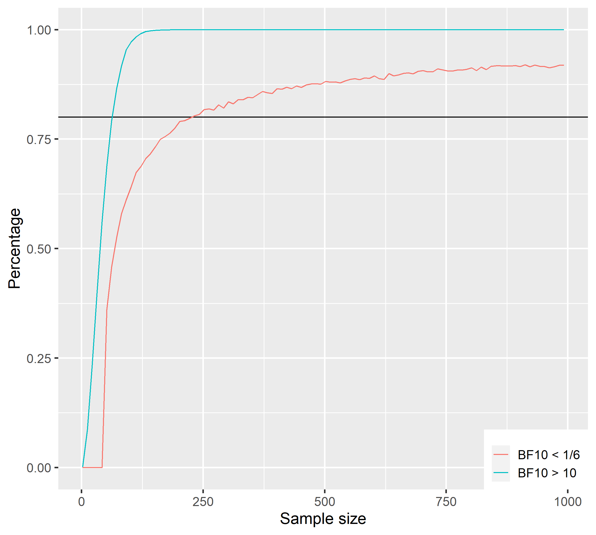
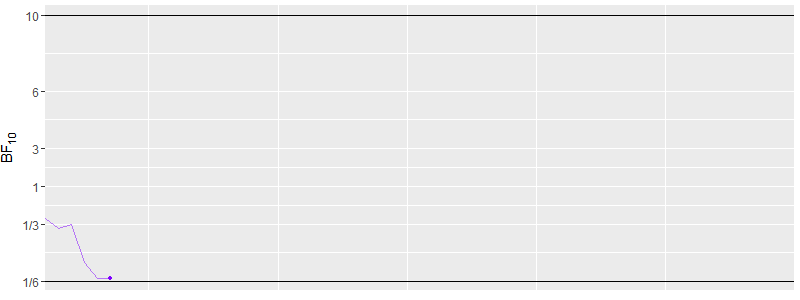
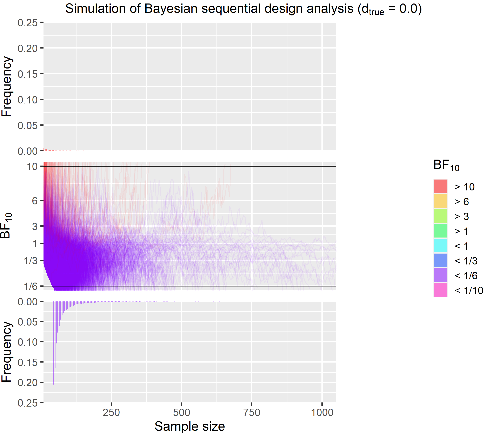
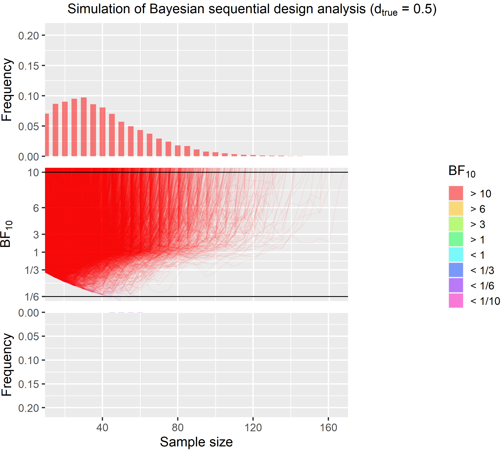
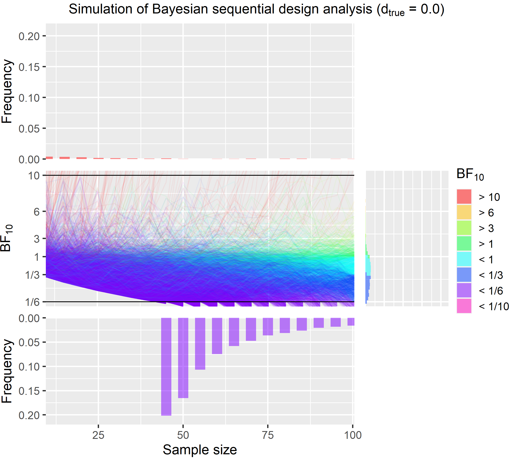
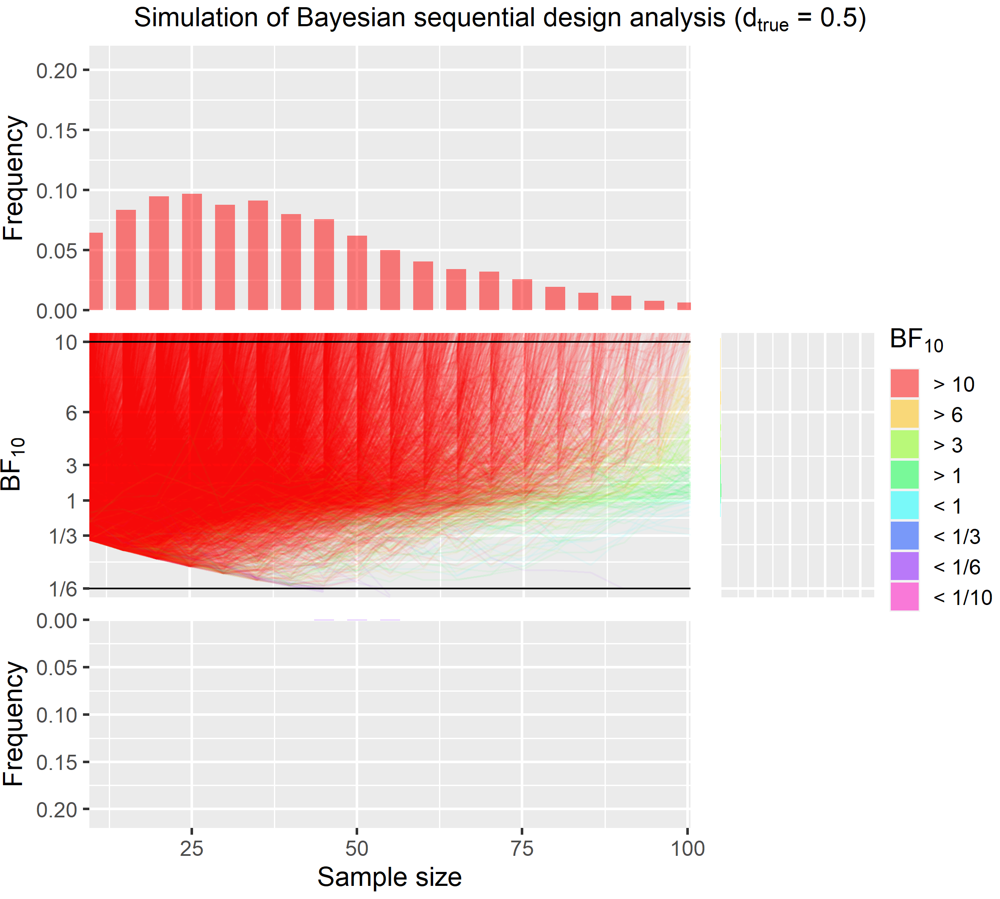

Call on Sequential Bayesian Designs
================

This post is based on a short talk that I gave at the MRC CBU on the 29
July 2020 for a session on statistical power, which can be found
[here](https://github.com/JAQuent/bayesianSequentialDesign). This
repository also includes all the data and script that were used to run
the simulations and to create the figures. Most of this talk as well as
of this post is based on Schoenbrodt & Wagenmakers (2018) fantastic
paper that I encourage you to read as well as the other good articles in
that special on Bayesian statistics.

Like a traditional power analysis using frequentist statistics, we can
calculate for which fixed sample size we get a Bayes factor (BF)
surpassing a certain criterion in let’s say 80 % of the cases if
repeated the data collection multiple times assuming a specific fixed
effect size.

This is illustrated in the Figure below:



This figure shows the results of a traditoinal fixed sample size design
analysis. It is based on a Bayesian one-sample *t*-test and shows the
percentage of surpassing the criteria as a function of the sample size.
The blue line shows the percentage for \(BF_{10}\) over 10 for a true
medium effect size of 0.5, while the red line shows a \(BF_{10}\) below
1/6 for a true null effect size of 0.0. I choose this assymmetric
cut-off because it is much more difficult to get strong evidence for the
point \(H_0\) than it is for the \(H_1\). Similarly, to each high
percentage values like 95 %, we would need a sample size that is much
larger than this in fact over 1000. Sidenote, this simulation like on
the one in this post is based on 10,000 iterations. If we plan for true
effect size of 0.5, the necessary sample size is 72, while it is 232 if
the true effect size is 0.0. Collecting a sample size that is that large
for one experiment is quite impossible for a basic science experiment in
my field (cognitive neuroscience).

Likely, there is a way to reliably produce strong evidence with sample
that are much smaller. For that we need *Sequential Bayesian Designs*.
The properties of the BF allows us to peak at the data multiple times to
see what the current evidence from our data is. In a sequential design
we essentially keep on collecting data until reached the pre-specified
evidence criteria for instance a \(BF_{10} > 10\) or \(BF_{10} < 1/6\).
Below you see an example piece of code that can run this kind of
simulation in simple for loop.

``` r
# Setting seed
set.seed(2)

# Parameters
minN      <- 10
batchSize <- 5
crit1     <- 10
crit2     <- 1/6
maxN      <- 300
nIter     <- 100
d         <- 0

for(i in 1:nIter){
  # First iteration
  data <- rnorm(minN, d, 1)
  n    <- minN
  bf   <- reportBF(ttestBF(data))
  
  # Loop
  while(bf[length(bf)] < crit1 & bf[length(bf)] > crit2){
    data <- c(data, rnorm(minN, d, 1))
    bf[length(bf) + 1] <- reportBF(ttestBF(data))
    n[length(n) + 1]   <- n[length(n)] + batchSize
  }
  
  if(i == 1){
    df <- data.frame(id = rep(i, length(bf)), n = n, bf = bf)
  } else {
    df <- rbind(df, data.frame(id =  rep(i, length(bf)), n = n, bf = bf))
  }
}
```

In this example we start with a sample size of 10 and then keep adding 5
more data points until we either reach `crit1` or `crit2`. The true
effect size here is 0.0. This simulation of 100 iterations is
illustrated in this animation highlighting the sequential nature of the
data collection. Note that the x-axis is the sample size. Each
individual line represents one run in this simulation.



A full simulation of 10,000 iteration is shown in the figure below. The
true effect size here is 0.0.



Here is a quick explanation of that this figure shows. For the code to
generated this figure see
[here](https://github.com/JAQuent/bayesianSequentialDesign). Like in the
animation, each individual line in the middle part of the figure
represents one iteration of this simulation. The lines are colour coded
based on the final BF (red = \(BF_{10} > 10\), purple =
\(BF_{10} < 1/6\)). At the top and the bottom, you see histograms
showing how many BF were above and below the criteria for each sample
size. Two things are apparent at the first glance. First, there is very
little misleading evidence. Misleading evidence for this simulation mean
\(BF_{10} > 10\) as the true effect is 0.0. The red lines in the middle
and the barely percetpible red bars in the top histogram show this.
Second, most simulations end well before the 232 that are need to get a
\(BF_{10} < 1/6\) 80 % of the times in the traditional design but we
also see that in some case data collection goes well beyond 500 data
points and in fact this figure is capped at 1000 for illustration in
fact the highest sample size was 2765 and 10 were above 1000. On
average, however we can stop data collection with sample size of only
83, which is much lower than the traditional design.

For further illustration, I also present a simulation were we have true
medium effect size of 0.5.



This figure also clearly shows that most runs end much earier than the
72 from the fixed sample size design. The highest sample size for this
effect size is 170.

Now, to the most interesting part that is comparing the traditional
fixed sample size design and the sequential design. In the table below,
you see the costs for an 1-hour long online experiment on prolific (£
8.4) and an 1-hour long fMRI experiment (full economic costs £ 550).

| Effect size | Necessary sample size | Misleading evidence in % | £ for online experiment | £ for fMRI experiment |
| ----------: | --------------------: | -----------------------: | ----------------------: | --------------------: |
|         0.5 |                    72 |                   0.0003 |                     605 |                 39600 |
|         0.0 |                   232 |                   0.0011 |                    1949 |                127600 |

Based on the results, we would need to spend a lot of money for each
experiments. In the worst case scenario, where you plan for showing a
null effect in fMRI experiment, you need to spend £ 127600 it’s less if
you plan for a medium effect size but the problem is often we don’t
really have good estimate of the effect size. If we did, we might not
even run the experiment. Johan Carlin recently gave talk where he among
other things talked about the problem of bias effect size estimates and
low power. This tlaks can be found
[here](https://twitter.com/johancarlin/status/1273186119564144641).

| Effect size | Average sample size | Maximal sample size | Misleading evidence in % | £ for online experiment | £ for fMRI experiment |
| ----------: | ------------------: | ------------------: | -----------------------: | ----------------------: | --------------------: |
|         0.5 |                  41 |                 170 |                     0.13 |                     344 |                 22550 |
|         0.0 |                  83 |                2765 |                     2.95 |                     697 |                 45650 |

In true sequential design we don’t have this problem at all. Regardless
of the true effect size we produce strong evidence and this on average
much cheaper than with a fixed sample design. The average cost for an
fMRI experiment for instance is only £ 45650. This is only 6549 % of the
cost that’d have to play for a traditional design. At the same times, it
needs to be knowledge that the misleading evidence rate in much higher
in sequential designs is much higher but still very low. For instance,
for null effect in this simulation it is NA %. If misleading evidence
rates are of concerns than one thing that can be done is to increase the
minimal sample size and the number of data points added in each batch.
The effect of doing this is illustrated further below.

A much bigger problem is that while the average sample size is much
lower, sometimes we’re unluckily and we haven’t reached a stopping
criteria even after 1000 data points. For a PhD running an fMRI
experiment, this is just not feasible. Despite what [2
Unlimited](https://www.youtube.com/watch?v=awEnGXcmUXc) wants us to
believe, partically there is often a limit that can be based on money,
available participants or time constraints. One way to protect oneself
against collecting extremely large samples is to set an upper limit and
to accept that in rare and extreme cases we might stop despite note
having reached a criterion and ending with inconclusive evidence.

In the following, I will present a simulation where data collection is
stopped after collecting 100 data points regardless of whether an
evidence criterion is reached.





| Effect size | Average sample size | Strong evidence in % | Misleading evidence in % | Insufficient evidence in % |
| ----------: | ------------------: | -------------------: | -----------------------: | -------------------------: |
|         0.5 |                  39 |                98.05 |                     0.12 |                       1.83 |
|         0.0 |                  58 |                80.25 |                     2.31 |                      17.44 |

Stopping data at 100 data points protects against having to collect
extreme sample size but still produces solid evidence in most cases even
is the true effect is zero as in the first example above.

# Take home message

It is important to find the right parameters for the specific situation
that will lead to the most efficient data collection. Several factors
influnece the performance of Bayesian Sequential Designs that are

  - minimum sample size influences the rate of misleading evidence,
  - batch size (i.e. after how many new data points we check evidence),
  - choice priors and likelihood functions (If you want evidence for
    \(H_0\), there are better choices for this type of data. See my
    **[post](https://jaquent.github.io/post/comparing-different-methods-to-calculate-bayes-factors-for-a-simple-model/)**)
    and
  - directed vs. undirected hypothesis.

To get some idea how the parameters affect the performance of the
sequential designs I’ve compiled a summary table of a couple of
simulation that I ran for this talk. All simulations have the same
effect sizes and the same number of iterations (10,000).

| Design     | Direction | Minimal N | Batch size | Maximal N | Effect size | BF \> crit % | Sample size | Misleading evidence % | £ online epxeriment | £ fMRI experiment |
| :--------- | :-------- | --------: | ---------: | --------: | ----------: | -----------: | ----------: | --------------------: | ------------------: | ----------------: |
| Fixed n    | 2-sided   |        NA |         NA |        NA |         0.5 |        80.00 |          72 |                0.0003 |                 605 |             39600 |
| Fixed n    | 2-sided   |        NA |         NA |        NA |         0.0 |        80.00 |         232 |                0.0011 |                1949 |            127600 |
| Fixed n    | 1-sided   |        NA |         NA |        NA |         0.5 |        80.00 |          62 |                0.0000 |                 521 |             34100 |
| Fixed n    | 1-sided   |        NA |         NA |        NA |         0.0 |        80.00 |         232 |                0.0026 |                1949 |            127600 |
| Sequential | 2-sided   |        10 |          5 |        NA |         0.5 |       100.00 |          41 |                0.1300 |                 344 |             22550 |
| Sequential | 2-sided   |        10 |          5 |        NA |         0.0 |       100.00 |          83 |                2.9500 |                 697 |             45650 |
| Sequential | 1-sided   |        10 |          5 |        NA |         0.5 |       100.00 |          34 |                1.1400 |                 286 |             18700 |
| Sequential | 1-sided   |        10 |          5 |        NA |         0.0 |       100.00 |          62 |                3.3700 |                 521 |             34100 |
| Sequential | 2-sided   |        10 |          5 |       100 |         0.5 |        98.05 |          39 |                0.1200 |                 328 |             21450 |
| Sequential | 2-sided   |        10 |          5 |       100 |         0.0 |        80.25 |          58 |                2.3100 |                 674 |             44138 |
| Sequential | 2-sided   |        10 |          1 |       100 |         0.5 |        98.19 |          35 |                0.1800 |                 294 |             19250 |
| Sequential | 2-sided   |        10 |          1 |       100 |         0.0 |        82.08 |          55 |                3.6900 |                 689 |             45144 |
| Sequential | 2-sided   |         2 |          5 |       100 |         0.5 |        98.05 |          39 |                0.2500 |                 328 |             21450 |
| Sequential | 2-sided   |         2 |          5 |       100 |         0.0 |        79.27 |          59 |                2.9500 |                 666 |             43599 |

Note that the estimattion of the mis leading evidence rates is probably
a bit noisy (despite running 10,000 iterations). The best way to keep
this low is to start a higher minimal N. For the scope of my talk I
haven’t ran a simulation yet. However, all in all the table above shows
that sequential designs perform well regardless of the sampling plan.
