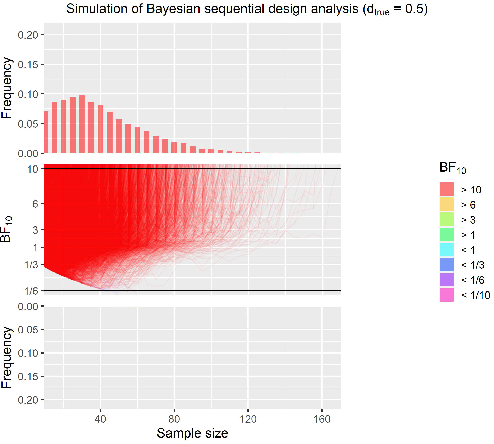

```{r setup, include=FALSE}
knitr::opts_chunk$set(echo = FALSE, warning = FALSE, message = FALSE, eval = FALSE)

library(plyr)
library(BayesFactor)
library(knitr)
library(assortedRFunctions)
library(ggplot2)

options(scipen = 10)
```


# What will I talk about?
- I want to show you a way to collect data that produces strong evidence but saves resources:
<br>
<br>
<center>__Bayesian Sequential Designs__</center>
<br>
<br>
- Basics: Frequentist vs. Bayesian statistics.

# What will I talk about?
- I want to show you a way to collect data that produces strong evidence but saves resources:
<br>
<br>
<center>__Bayesian Sequential Designs__</center>
<br>
<br>
- Basics: Frequentist vs. Bayesian statistics.
- Much of what I say is based on this fantastic paper:


# Let's talk about the frequentist way
- Let's consider a simple one-sample _t_-test:

$$t = \frac{\overline{x} - \mu}{s_\overline{x}}$$
where 
$$ s_\overline{x} = \frac{s}{\sqrt{n}} $$
where  
  
$\mu$ = Proposed constant for the population mean  
$\overline{x}$ = Sample mean  
$n$ = Sample size (i.e., number of observations)  
$s$ = Sample standard deviation  
$s_\overline{x}$ = Estimated standard error of the mean

# Let's talk about the frequentist way
Our toy example:
```{r, echo = TRUE, eval = TRUE}
set.seed(911225)
n    <- 60
data <- rnorm(n, 0.0, 1)

df             <- n - 1
standard.error <- sd(data)/sqrt(n)
t.value        <- (mean(data) - 0)/standard.error 
```

# Let's talk about the frequentist way
<center>
{width=40%} 

</center>

```{r}
(1 - pt(t.value, df))*2
```


- The result is $p(data | H_0) = 0.011$.
- In other words, how likely is our observation (data) under the null hypothesis. 
- Note, a non-significant p-value doesn't mean the $H_0$ is true 
- and a significant p-value also doesn't mean that there is a meaningful effect. 

# A Bayesian way
- With Bayesian statistics, we can make completely different claims:

$$\underbrace{\frac{p(H_1 | data)}{p(H_0 | data)}}_\text{Posterior plausibility
about hypotheses} =  \underbrace{\frac{p(H_1)}{p(H_0)}}_\text{Prior plausibility
about hypotheses} \times \underbrace{\frac{p(data| H_1)}{p(data| H_0)}}_\text{Bayes factor =
Predictive updating factor}$$

Evidence in favour of alternative:

$$ BF_{10} = \frac{p(data| H_1)}{p(data| H_0)}$$

Evidence in favour of null:
$$ BF_{01} = \frac{p(data| H_0)}{p(data| H_1)}$$


This mean that you can just inverse them:
$$ BF_{10} = 1/BF_{01}$$

# Convention for Bayes Factors
```{r, eval = TRUE}
table0 <- data.frame(BF = c('> 100', '30 – 100', '10 – 30', '3 – 10', '1 – 3', '1', '1 – 1/3', '1/3 – 1/10', '1/10 – 1/30', '1/30 – 1/100 ', '< 1/100 '),
                     Evidence = c('Extreme evidence for $H_1$', 
                                  'Very strong evidence for $H_1$', 
                                  'Strong evidence for $H_1$', 
                                  'Moderate evidence for $H_1$', 
                                  'Anecdotal evidence for $H_1$',
                                  'No evidence',
                                  'Anecdotal evidence for $H_0$',
                                  'Moderate evidence for $H_0$',
                                  'Strong evidence for $H_0$',
                                  'Very strong evidence for $H_0$',
                                  'Extreme evidence for $H_0$'))

names(table0) <- c('$BF_{10}$', 'Evidence')
kable(table0)
```
<br>

- Most journals either require evidence of 6 or 10 in favour of the hypothesis.
- However, in practice evidence for $H_0$ is often more difficult to obtain then for $H_1$.
- For this talk, I am accepting $BF_{10} > 10$  and $BF_{10} < 1/6$ as evidence for $H_1$ and $H_0$.   

# A Bayesian way
- We can examine what probability of our hypothesis given the data is for our toy example. 

```{r, eval = TRUE, echo = TRUE}
library(BayesFactor)
ttestBF(data)
```

- Our $H_1$ is _only_ 3.2 more likely than $H_0$, which only provides anecdotal evidence.

# A Bayesian way
- Bayes factors are not ground truth and they depend on our priors and our alternative models.
- For instance, the Bayesian _t_-test (`ttestBF`) assume the following priors:

$$s_\overline{x} = \frac{s}{\sqrt{n}} \;\;\;\;\;\;\;\; t = \frac{\overline{x} - \mu}{s_\overline{x}}$$

<center>
  

Rouder et al. (2009)
</center>
  
```{r, eval = TRUE}
load("simulationResults.RData")

crit1 <- 10
crit2 <- 1/6
```

# Traditional design example
<center>
{width=40%} 
</center>

This shows that a large sample size is necessary to a probability of 80% that $BF_{10}$ > 10 or $BF_{10}$ < 1/6.

```{r, eval = TRUE}
# Calculatge percentage
df1_2            <- subset(df1, df1$side == 2)
df1_2$overCrit1  <- df1_2$bf > 10
df1_2$belowCrit2 <- df1_2$bf < 1/6
df1_2[df1_2$d == 0.0, 'overCrit1']  <- NA
df1_2[df1_2$d == 0.5, 'belowCrit2'] <- NA
df1_2_agg         <- ddply(df1_2, c('n'), summarise, per_crit1 = mean(overCrit1, na.rm = TRUE), per_crit2 = mean(belowCrit2, na.rm = TRUE))

# Misleading evidence
df1_2_miss            <- df1_2
df1_2_miss$overCrit1  <- df1_2_miss$bf > 10
df1_2_miss$belowCrit2 <- df1_2_miss$bf < 1/6
df1_2_miss_agg        <- ddply(df1_2_miss, c('n', 'd'), summarise, per_crit1 = mean(overCrit1, na.rm = TRUE), per_crit2 = mean(belowCrit2, na.rm = TRUE))


table2 <- data.frame(v1 = c(0.5, 0.0),
                     v2 = c(min(df1_2_agg[df1_2_agg$per_crit1 >= 0.8, 'n']), min(df1_2_agg[df1_2_agg$per_crit2 >= 0.8, 'n'])),
                     v3 = c(df1_2_miss_agg[df1_2_miss_agg$n == min(df1_2_agg[df1_2_agg$per_crit1 >= 0.8, 'n']) & df1_2_miss_agg$d == 0.5 , 'per_crit2'], 
                            df1_2_miss_agg[df1_2_miss_agg$n == min(df1_2_agg[df1_2_agg$per_crit2 >= 0.8, 'n']) & df1_2_miss_agg$d == 0.0 , 'per_crit1']))

names(table2) <- c('Effect size', 'Necessary sample size', 'Misleading evidence in %')
                     
table2$`£ for online experiment` <- round(table2$`Necessary sample size`*8.40)
table2$`£ for fMRI experiment`   <- round(table2$`Necessary sample size`*550)
kable(table2)
```

# Sequential design
- Start with a minimum sample size (e.g. 10) and add data (e.g. 5 new points) until we reach the $BF_{10}$ that we want. 

# Sequential design
- Start with a minimum sample size (e.g. 10) and add data (e.g. 5 new points) until we reach the $BF_{10}$ that we want. 

<center>

</center>

# Sequential design
```{r, eval = TRUE}
############### d = 0.0
tempDF <- subset(df2, side == 2 & d == 0.0)

tempDF$trans_bf <- NA
tempDF$trans_bf[tempDF$bf < 1] <- -1/tempDF$bf[tempDF$bf < 1] + 1
tempDF$trans_bf[tempDF$bf > 1] <- tempDF$bf[tempDF$bf > 1] - 1

tempDF_agg <- ddply(tempDF, c('id'), summarise, n = n[length(n)], bf = bf[length(bf)])
tempDF_agg$support <- 'undecided'
tempDF_agg$support[tempDF_agg$bf > crit1] <- 'H1'
tempDF_agg$support[tempDF_agg$bf < crit2] <- 'H0'

# Creates band
tempDF_agg$band                                             <- '> 10'
tempDF_agg$band[tempDF_agg$bf < 10 & tempDF_agg$bf > 6]     <- '> 6'
tempDF_agg$band[tempDF_agg$bf < 6 & tempDF_agg$bf > 3]      <- '> 3'
tempDF_agg$band[tempDF_agg$bf < 3 & tempDF_agg$bf > 1]      <- '> 1'
tempDF_agg$band[tempDF_agg$bf < 1 & tempDF_agg$bf > 1/3]    <- '< 1'
tempDF_agg$band[tempDF_agg$bf < 1/3 & tempDF_agg$bf > 1/6]  <- '< 1/3'
tempDF_agg$band[tempDF_agg$bf < 1/6 & tempDF_agg$bf > 1/10] <- '< 1/6'
tempDF_agg$band[tempDF_agg$bf < 1/10]                       <- '< 1/10'

# Create factor band
tempDF_agg$band <- factor(tempDF_agg$band, levels = c('> 10', '> 6', '> 3', '> 1', '< 1', '< 1/3', '< 1/6', '< 1/10'))

# Get back to main DF
tempDF$band <- rep(tempDF_agg$band, table(tempDF$id))

# Create lower histogram
tempDF_agg_supp_H0 <- ddply(subset(tempDF_agg, support == 'H0'),
                            c('n', 'band'),
                            summarise,
                            freq = length(bf)/nIter)
# Create upper histogram
tempDF_agg_supp_H1 <- ddply(subset(tempDF_agg, support == 'H1'),
                            c('n', 'band'),
                            summarise,
                            freq = length(bf)/nIter)

# Get sample sizes
sampleSize_df1           <- rbind(tempDF_agg_supp_H0, tempDF_agg_supp_H1)
sampleSize_df1$count     <- sampleSize_df1$freq * nIter
tempDF_agg_supp_H1$count <- tempDF_agg_supp_H1$freq * nIter

#Calculate results
avgN1    <- round(mean(rep(sampleSize_df1$n, sampleSize_df1$count)))
misLead1 <- sum(tempDF_agg_supp_H1$freq)*100
maxN1    <- max(tempDF_agg$n)

############### d = 0.5
tempDF <- subset(df2, side == 2 & d == 0.5)

tempDF$trans_bf <- NA
tempDF$trans_bf[tempDF$bf < 1] <- -1/tempDF$bf[tempDF$bf < 1] + 1
tempDF$trans_bf[tempDF$bf > 1] <- tempDF$bf[tempDF$bf > 1] - 1

tempDF_agg <- ddply(tempDF, c('id'), summarise, n = n[length(n)], bf = bf[length(bf)])
tempDF_agg$support <- 'undecided'
tempDF_agg$support[tempDF_agg$bf > crit1] <- 'H1'
tempDF_agg$support[tempDF_agg$bf < crit2] <- 'H0'


# Creates band
tempDF_agg$band                                             <- '> 10'
tempDF_agg$band[tempDF_agg$bf < 10 & tempDF_agg$bf > 6]     <- '> 6'
tempDF_agg$band[tempDF_agg$bf < 6 & tempDF_agg$bf > 3]      <- '> 3'
tempDF_agg$band[tempDF_agg$bf < 3 & tempDF_agg$bf > 1]      <- '> 1'
tempDF_agg$band[tempDF_agg$bf < 1 & tempDF_agg$bf > 1/3]    <- '< 1'
tempDF_agg$band[tempDF_agg$bf < 1/3 & tempDF_agg$bf > 1/6]  <- '< 1/3'
tempDF_agg$band[tempDF_agg$bf < 1/6 & tempDF_agg$bf > 1/10] <- '< 1/6'
tempDF_agg$band[tempDF_agg$bf < 1/10]                       <- '< 1/10'

# Create factor band
tempDF_agg$band <- factor(tempDF_agg$band, levels = c('> 10', '> 6', '> 3', '> 1', '< 1', '< 1/3', '< 1/6', '< 1/10'))


# Get back to main DF
tempDF$band <- rep(tempDF_agg$band, table(tempDF$id))


# Create upper histogram
tempDF_agg_supp_H1 <- ddply(subset(tempDF_agg, support == 'H1'),
                           c('n', 'band'),
                           summarise,
                           freq = length(bf)/nIter)

# Create lower histogram
tempDF_agg_supp_H0 <- ddply(subset(tempDF_agg, support == 'H0'),
                           c('n', 'band'),
                           summarise,
                           freq = length(bf)/nIter)


sampleSize_df2           <- rbind(tempDF_agg_supp_H0, tempDF_agg_supp_H1)
sampleSize_df2$count     <- sampleSize_df2$freq * nIter
tempDF_agg_supp_H0$count <- tempDF_agg_supp_H0$freq * nIter

# Calculate results
avgN2    <- round(mean(rep(sampleSize_df2$n, sampleSize_df2$count)))
misLead2 <- sum(tempDF_agg_supp_H0$freq)*100
maxN2    <- max(tempDF_agg$n)
```
 
<center> 
{width=40%} {width=40%} 
</center>

<br>
<br>
```{r, eval = TRUE}
table3 <- data.frame(v1 = c(0.5, 0.0),
                     v2 = c(avgN2, avgN1),
                     v3 = c(maxN2, maxN1),
                     v3 = c(misLead2, misLead1))

names(table3) <- c('Effect size', 'Average sample size', 'Maximal sample size', 'Misleading evidence in %')
kable(table3)
```


# Pure sequential design example
- The advantage is that this approach is guaranteed to provide strong evidence. 
- Expected sample sizes are much lower than those of the traditional design. 

<br>

Costs for traditional designs:

```{r, eval = TRUE}
kable(table2)
```

<br>

Costs for pure sequential design:
```{r, eval = TRUE}
table4 <- data.frame(v1 = c(0.5, 0.0),
                     v2 = c(avgN2, avgN1),
                     v3 = c(maxN2, maxN1),
                     v3 = c(misLead2, misLead1))

names(table4) <- c('Effect size', 'Average sample size', 'Maximal sample size', 'Misleading evidence in %')

table4$`£ for online experiment` <- round(table4$`Average sample size`*8.40)
table4$`£ for fMRI experiment`   <- round(table4$`Average sample size`*550)
kable(table4)
```

# Setting an upper limit
- Practically, there is often is a limit.
- To prevent us from collecting thousands of participants for only one hypothesis, we can set an upper limit (i.e. maximal N).
- This limit can be based on:
  - Money,
  - Available participants or 
  - Time constraints. 
  
# Setting an upper limit
- We stop data collection at a sample size of 100. 

<center> 
{width=40%} {width=40%} 
</center>

```{r, eval = TRUE}
# Parmeter
maxN <- 100

###### D = 0.0
tempDF <- subset(df3, d == 0.0)

tempDF$trans_bf <- NA
tempDF$trans_bf[tempDF$bf < 1] <- -1/tempDF$bf[tempDF$bf < 1] + 1
tempDF$trans_bf[tempDF$bf > 1] <- tempDF$bf[tempDF$bf > 1] - 1

tempDF_agg <- ddply(tempDF, c('id'), summarise, n = n[length(n)], bf = bf[length(bf)])
tempDF_agg$support <- 'undecided'
tempDF_agg$support[tempDF_agg$bf > crit1] <- 'H1'
tempDF_agg$support[tempDF_agg$bf < crit2] <- 'H0'

# Creates band
tempDF_agg$band                                             <- '> 10'
tempDF_agg$band[tempDF_agg$bf < 10 & tempDF_agg$bf > 6]     <- '> 6'
tempDF_agg$band[tempDF_agg$bf < 6 & tempDF_agg$bf > 3]      <- '> 3'
tempDF_agg$band[tempDF_agg$bf < 3 & tempDF_agg$bf > 1]      <- '> 1'
tempDF_agg$band[tempDF_agg$bf < 1 & tempDF_agg$bf > 1/3]    <- '< 1'
tempDF_agg$band[tempDF_agg$bf < 1/3 & tempDF_agg$bf > 1/6]  <- '< 1/3'
tempDF_agg$band[tempDF_agg$bf < 1/6 & tempDF_agg$bf > 1/10] <- '< 1/6'
tempDF_agg$band[tempDF_agg$bf < 1/10]                       <- '< 1/10'

# Create factor band
tempDF_agg$band <- factor(tempDF_agg$band, levels = c('> 10', '> 6', '> 3', '> 1', '< 1', '< 1/3', '< 1/6', '< 1/10'))


# Get back to main DF
tempDF$band <- rep(tempDF_agg$band, table(tempDF$id))


# Create upper histogram
tempDF_agg_supp_H1 <- ddply(subset(tempDF_agg, support == 'H1'),
                           c('n', 'band'),
                           summarise,
                           freq = length(bf)/nIter)

# Create right histogram
tempDF_agg_undecided <- subset(tempDF_agg, tempDF_agg$n == maxN & tempDF_agg$bf < crit1 & tempDF_agg$bf > crit2)
tempDF_agg_undecided$trans_bf <- NA
tempDF_agg_undecided$trans_bf[tempDF_agg_undecided$bf < 1] <- -1/tempDF_agg_undecided$bf[tempDF_agg_undecided$bf < 1] + 1
tempDF_agg_undecided$trans_bf[tempDF_agg_undecided$bf > 1] <- tempDF_agg_undecided$bf[tempDF_agg_undecided$bf > 1] - 1


# Create lower histogram
tempDF_agg_supp_H0 <- ddply(subset(tempDF_agg, support == 'H0'),
                           c('n', 'band'),
                           summarise,
                           freq = length(bf)/nIter)


# Creates empty df for plotting if no values
if(nrow(tempDF_agg_supp_H0) == 0){
  tempDF_agg_supp_H0 <- data.frame(n = seq(1, 5, 1),
                                band = rep('< 1/10', 5),
                                freq = rep(0, 5))
}


sampleSize_df3           <- rbind(tempDF_agg_supp_H0, tempDF_agg_supp_H1)
sampleSize_df3$count     <- sampleSize_df3$freq * nIter
tempDF_agg_supp_H1$count <- tempDF_agg_supp_H1$freq * nIter

# Get summary
avgN1       <- round(mean(rep(sampleSize_df3$n, sampleSize_df3$count)))
misLead1    <- sum(tempDF_agg_supp_H1$freq)*100
strongEvi1  <- sum(tempDF_agg_supp_H0$freq)*100
undecided1  <- round(nrow(tempDF_agg_undecided)/nIter, 4)*100


######## d = 0.5
tempDF <- subset(df3, d == 0.5)
tempDF$trans_bf <- NA
tempDF$trans_bf[tempDF$bf < 1] <- -1/tempDF$bf[tempDF$bf < 1] + 1
tempDF$trans_bf[tempDF$bf > 1] <- tempDF$bf[tempDF$bf > 1] - 1

tempDF_agg <- ddply(tempDF, c('id'), summarise, n = n[length(n)], bf = bf[length(bf)])
tempDF_agg$support <- 'undecided'
tempDF_agg$support[tempDF_agg$bf > crit1] <- 'H1'
tempDF_agg$support[tempDF_agg$bf < crit2] <- 'H0'


# Creates band
tempDF_agg$band                                             <- '> 10'
tempDF_agg$band[tempDF_agg$bf < 10 & tempDF_agg$bf > 6]     <- '> 6'
tempDF_agg$band[tempDF_agg$bf < 6 & tempDF_agg$bf > 3]      <- '> 3'
tempDF_agg$band[tempDF_agg$bf < 3 & tempDF_agg$bf > 1]      <- '> 1'
tempDF_agg$band[tempDF_agg$bf < 1 & tempDF_agg$bf > 1/3]    <- '< 1'
tempDF_agg$band[tempDF_agg$bf < 1/3 & tempDF_agg$bf > 1/6]  <- '< 1/3'
tempDF_agg$band[tempDF_agg$bf < 1/6 & tempDF_agg$bf > 1/10] <- '< 1/6'
tempDF_agg$band[tempDF_agg$bf < 1/10]                       <- '< 1/10'

# Create factor band
tempDF_agg$band <- factor(tempDF_agg$band, levels = c('> 10', '> 6', '> 3', '> 1', '< 1', '< 1/3', '< 1/6', '< 1/10'))


# Get back to main DF
tempDF$band <- rep(tempDF_agg$band, table(tempDF$id))


# Create upper histogram
tempDF_agg_supp_H1 <- ddply(subset(tempDF_agg, support == 'H1'),
                           c('n', 'band'),
                           summarise,
                           freq = length(bf)/nIter)


# Create right histogram
tempDF_agg_undecided <- subset(tempDF_agg, tempDF_agg$n == maxN & tempDF_agg$bf < crit1 & tempDF_agg$bf > crit2)
tempDF_agg_undecided$trans_bf <- NA
tempDF_agg_undecided$trans_bf[tempDF_agg_undecided$bf < 1] <- -1/tempDF_agg_undecided$bf[tempDF_agg_undecided$bf < 1] + 1
tempDF_agg_undecided$trans_bf[tempDF_agg_undecided$bf > 1] <- tempDF_agg_undecided$bf[tempDF_agg_undecided$bf > 1] - 1


# Create lower histogram
tempDF_agg_supp_H0 <- ddply(subset(tempDF_agg, support == 'H0'),
                           c('n', 'band'),
                           summarise,
                           freq = length(bf)/nIter)


# Creates empty df for plotting if no values
if(nrow(tempDF_agg_supp_H0) == 0){
  tempDF_agg_supp_H0 <- data.frame(n = seq(1, 5, 1),
                                band = rep('< 1/10', 5),
                                freq = rep(0, 5))
}


sampleSize_df3           <- rbind(tempDF_agg_supp_H0, tempDF_agg_supp_H1)
sampleSize_df3$count     <- sampleSize_df3$freq * nIter
tempDF_agg_supp_H0$count <- tempDF_agg_supp_H0$freq * nIter

# Get summary
avgN2       <- round(mean(rep(sampleSize_df3$n, sampleSize_df3$count)))
misLead2    <- sum(tempDF_agg_supp_H0$freq)*100
strongEvi2  <- sum(tempDF_agg_supp_H1$freq)*100
undecided2  <- round(nrow(tempDF_agg_undecided)/nIter, 4)*100
```


<br>
<br>
```{r, eval = TRUE}
table5 <- data.frame(v1 = c(0.5, 0.0),
                     v2 = c(avgN2, avgN1),
                     v3 = c(strongEvi2, strongEvi1),
                     v4 = c(misLead2, misLead1),
                     v5 = c(undecided2, undecided1))

names(table5) <- c('Effect size', 'Average sample size', 'Strong evidence in %', 'Misleading evidence in %', 'Insufficient evidence in %')
kable(table5)
```

# Advantages of sequential designs
- Sequential designs are much more efficient even without a setting an upper limit. 
- If planned generically (i.e. for no, small, medium or large effect), biased effect size estimates are no problem. 
- There is high likelihood of obtaining strong evidence regardless of effect size. 
- The interpretation of BF does not depend on stopping rules (unlike p-values; Schoenbrodt & Wagenmakers, 2018).
- Sequential designs should be pre-registered. 

__But__
  
- Things get messy if you have more than one main hypothesis. 

# General remarks
- Several factors influence performance of sequential stopping rules:
  - The minimum sample size influences the rate of misleading evidence.
  - The batch size (i.e. after how many new data points we check evidence).
  - Choice priors and likelihood functions. If you want evidence for $H_0$, there are better choices. See my __[post](https://jaquent.github.io/post/comparing-different-methods-to-calculate-bayes-factors-for-a-simple-model/)__.
  - Make use of directed hypothesis to cut sample sizes. 
- Evidence doesn't need to be quantified with BF. Alternatives are CI or precision. 

# Concluding words 
<center>_The CBU should use sequential designs more often._</center> 

# Further reading and material
- [Special issue in Psychonomic Bulletin & Review volume: Bayesian methods for advancing psychological science](https://link.springer.com/journal/13423/25/1)
  - Schönbrodt, F. D., & Wagenmakers, E.-J. (2018). _Bayes factor design analysis: Planning for compelling evidence_. Psychonomic Bulletin & Review, 25(1), 128–142. https://doi.org/10.3758/s13423-017-1230-y
  - Etz, A., & Vandekerckhove, J. (2018). _Introduction to Bayesian Inference for Psychology_. Psychonomic Bulletin & Review, April 2017, 5–34. https://doi.org/10.3758/s13423-017-1262-3
  - Wagenmakers, E.-J., Marsman, M., Jamil, T., Ly, A., Verhagen, J., Love, J., Selker, R., Gronau, Q. F., Šmíra, M., Epskamp, S., Matzke, D., Rouder, J. N., & Morey, R. D. (2018). _Bayesian inference for psychology. Part I: Theoretical advantages and practical ramifications_. Psychonomic Bulletin & Review, 25(1), 35–57. https://doi.org/10.3758/s13423-017-1343-3
- Rouder, J. N., Speckman, P. L., Sun, D., Morey, R. D., & Iverson, G. (2009). _Bayesian t tests for accepting and rejecting the null hypothesis. Psychonomic Bulletin & Review_, 16(2), 225–237. https://doi.org/10.3758/PBR.16.2.225


All code can be found __[here](https://github.com/JAQuent/bayesianSequentialDesign)__.
Further points and more simulations can be found __[here](https://jaquent.github.io/post/bayesian-sequential-designs-are-superior/)__.
